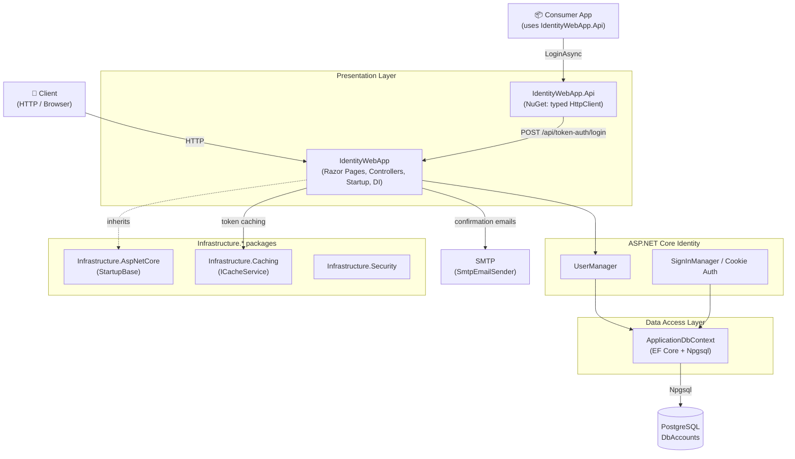
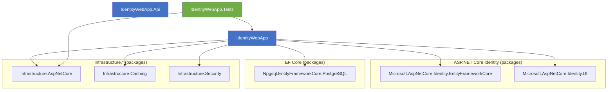
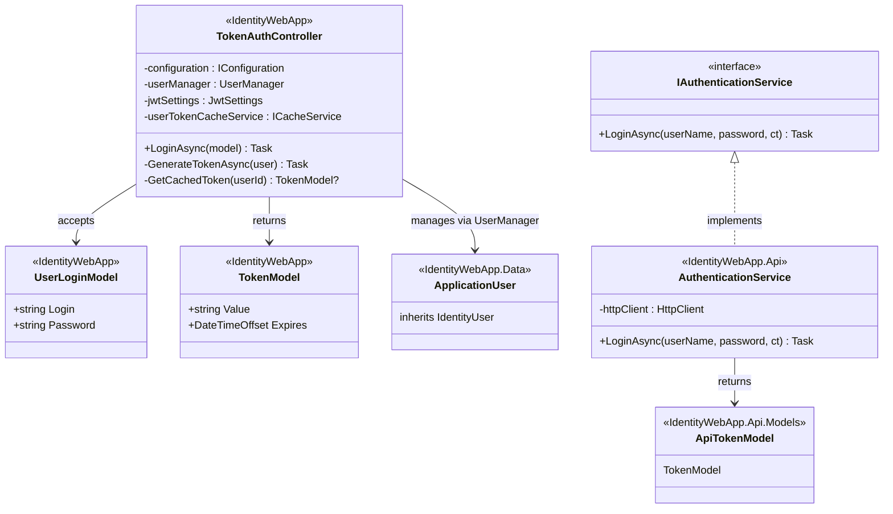
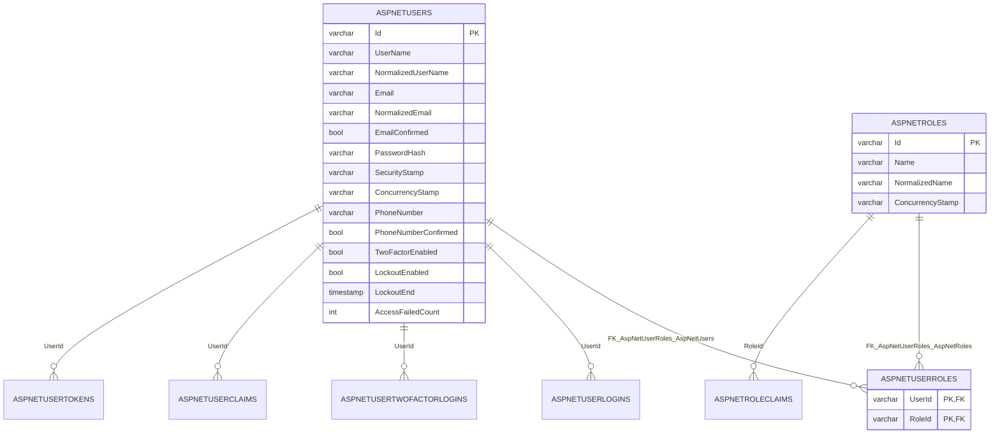

# IdentityWebApp

ASP.NET Core web application (.NET 9) for managing application users based on **ASP.NET Core Identity**: registration, login, email confirmation, user management, as well as issuing **JWT tokens** via the REST API (`/api/token-auth/login`).

The solution includes the client library **IdentityWebApp.Api** (a NuGet package) that simplifies integration of third-party .NET applications with the authentication API.

---

## Table of Contents

1. [General Architecture](#general-architecture)
2. [Solution Structure and Project Purpose](#solution-structure-and-project-purpose)
3. [Project Dependency Diagram](#project-dependency-diagram)
4. [UML Class Diagram of the Authentication Domain](#uml-class-diagram-of-the-authentication-domain)
5. [API Methods and Error Handling](#api-methods-and-error-handling)
6. [Database Model (ER Diagram)](#database-model-er-diagram)
7. [Build and Run](#build-and-run)
8. [Configuration](#configuration)
9. [Testing](#testing)

---

## General Architecture

The application is built on top of `Infrastructure.AspNetCore.StartupBase` — the `Program.cs` entry point delegates configuration to the `Startup` class, which registers services (DI container) and the HTTP request pipeline. The presentation layer combines **Razor Pages** (Identity UI: registration, login, email confirmation) and a **Web API** (JWT token issuing).



**Key principles:**

| Principle | How it is implemented |
|---|---|
| Startup pattern | All configuration is concentrated in `Startup.cs` (inherits `Infrastructure.AspNetCore.StartupBase`) |
| Two authentication scenarios | Cookie authentication for the UI (Razor Pages) and JWT Bearer for the API |
| Token caching | An issued JWT is cached via `ICacheService<string, string>` and reused until it expires |
| Configuration constants | Section names are centralized in `AppConstants` (`JWT:ServiceApiKey`, `SmtpSettings`, etc.) |
| Reusable client | The `IdentityWebApp.Api` library is published as a NuGet package with one-line DI registration |

---

## Solution Structure and Project Purpose

| Project | Layer | Purpose |
|---|---|---|
| `IdentityWebApp` | Presentation + Identity | Web application: Razor Pages (`Areas/Identity/Pages/Account`), `TokenAuthController`, `Startup`, `ApplicationDbContext`, email sending via SMTP |
| `IdentityWebApp.Api` | Presentation (client) | NuGet package (v3.2.1, MIT): `IAuthenticationService.LoginAsync`, DTOs (`UserModel`, `TokenModel`), named HttpClient, DI extension `AddIdentityWebAppAuthentication` |
| `IdentityWebApp.Tests` | Tests | xUnit + Moq tests for the `TokenAuthController` (`LoginAsync`) |

**Key components of the main project:**

| Component | Location | Purpose |
|---|---|---|
| `Program.cs` → `Startup.cs` | project root | Entry point, DI registration, request pipeline |
| `ApplicationDbContext` | `Data/` | `IdentityDbContext<ApplicationUser, ApplicationRole, string>` (EF Core + Npgsql) |
| `ApplicationUser` / `ApplicationRole` | `Data/` | User and role entities (inheriting `IdentityUser` / `IdentityRole`) |
| `TokenAuthController` | `Controllers/` | `POST api/token-auth/login` — validation, password check, JWT issuing |
| `UserLoginModelValidator` | `Areas/Identity/Validators/` | Login model validation |
| Razor Pages | `Areas/Identity/Pages/Account/` | `Register`, `Login`, `Logout`, `ConfirmEmail`, `Manage/Index` |
| `SmtpEmailSender` / `SmtpClientCreator` | `Services/` | Email sending (email confirmation) |
| `JwtSettings`, `SmtpSettings` | `Other/Settings/` | Typed settings (`JwtSettings.ExpiresInSeconds`, etc.) |

---

## Project Dependency Diagram

Arrow direction means «depends on».



- `IdentityWebApp` — the root project (Composition Root): selects the database implementation (Npgsql), registers Identity, JWT authentication and services.
- `IdentityWebApp.Api` — a standalone NuGet package that depends only on `Microsoft.Extensions.DependencyInjection` / `Microsoft.Extensions.Http`; it does not reference the main project.
- `IdentityWebApp.Tests` — tests the controller through mocks (`UserManager`, `IConfiguration`, `IOptions<JwtSettings>`) without touching the database.

---

## UML Class Diagram of the Authentication Domain



The client library `IdentityWebApp.Api` encapsulates the HTTP interaction: `AuthenticationService` sends a `UserModel` to `/api/token-auth/login`, deserializes the `TokenModel` and handles errors centrally (`InvalidOperationException` on 401, `IOException` when the server is unreachable).

---

## API Methods and Error Handling

### Methods

| Component | Method | Description |
|---------|--------|-------------|
| `TokenAuthController` (Web API) | `POST /api/token-auth/login` | Validates the login model, checks credentials via `UserManager` and returns a JWT `TokenModel { value, expires }`; an issued token is cached via `ICacheService<string, string>` and reused until it expires |
| `AuthenticationService` (IdentityWebApp.Api) | `LoginAsync(userName, password, cancellationToken?)` | Authenticates a user against the API above and returns a `TokenModel`; sends a `POST` request with a `UserModel { login, password }` body |

> 💡 **Note:** The `cancellationToken` parameter is optional (defaults to `CancellationToken.None`). For detailed signatures and XML documentation, see `IAuthenticationService` in your IDE.

### Error Handling

**Server side** (`TokenAuthController`):

| Situation | HTTP status |
|-----------|-------------|
| Validation errors (`ModelState`) | `400 BadRequest` |
| User not found or invalid password | `401 Unauthorized` |
| Successful authentication | `200 OK` (TokenModel) |

**Client side** (`AuthenticationService` in `IdentityWebApp.Api`):

| Situation | HTTP status | Exception | Message |
|-----------|-------------|-----------|---------|
| Invalid login or password | `401 Unauthorized` | `InvalidOperationException` | «Неверный логин или пароль.» |
| Server unreachable or other non-success response | any non-success | `IOException` | «Ошибка подключения к серверу.» |
| Unexpected error (e.g. token deserialization failure) | — | `InvalidOperationException` | «Произошла непредвиденная ошибка при аутентификации.» |
| Operation cancelled via `CancellationToken` | — | `OperationCanceledException` | «Аутентификация отменена.» |

All client-side error messages are centralized in `ErrorMessagesConstants`.

---

## Database Model (ER Diagram)

The **DbAccounts** database (PostgreSQL) contains 8 ASP.NET Core Identity tables:



**Tables:** `AspNetUsers`, `AspNetRoles`, `AspNetUserRoles`, `AspNetUserClaims`, `AspNetRoleClaims`, `AspNetUserLogins`, `AspNetUserTokens`, `AspNetUserTwoFactorLogins` + the service table `__EFMigrationsHistory`.

**EF Core migrations:**

| Migration | Purpose |
|---|---|
| `00000000000000_CreateIdentitySchema` | Creating the Identity schema (8 tables) |
| `20250323090342_AddApplicationUser` | Adjusting the schema for `ApplicationUser` |
| `20250426084331_AddIdentityRoles` | Adding roles (`ApplicationRole`) |

---

## Build and Run

```bash
# Build the solution
dotnet build IdentityWebApp.sln

# Run the web application
cd IdentityWebApp
dotnet run

# Apply migrations (from the IdentityWebApp directory)
dotnet ef database update --project ../IdentityWebApp/IdentityWebApp.csproj

# Pack the client library NuGet package
dotnet pack IdentityWebApp.Api/IdentityWebApp.Api.csproj
```

---

## Configuration

Main sources: `appsettings.json`, `appsettings.Development.json` and **User Secrets** (for local development — the JWT key and other sensitive data).

| Section / key | Description |
|---|---|
| `ConnectionStrings:DefaultConnection` | PostgreSQL connection string (`DbAccounts`) |
| `JwtSettings:ExpiresInSeconds` | JWT token lifetime (default `600` seconds) |
| `JWT:ServiceApiKey` | JWT signing key (HMAC-SHA512); stored in User Secrets |
| `SmtpSettings` (`Host`, `Port`, `Username`) | SMTP server settings for sending emails |

**Identity parameters** (set in `Startup.cs`):

| Parameter | Value |
|---|---|
| `Password.RequiredLength` | 8 |
| `Password.RequiredUniqueChars` | 6 |
| `Lockout.MaxFailedAccessAttempts` | 5 |
| `Lockout.DefaultLockoutTimeSpan` | 5 minutes |
| Cookie: `IdentityWebAppCookie` | Lifetime of 20 minutes |

**Connecting the client library** (in a consumer application):

```csharp
builder.Services.AddIdentityWebAppAuthentication(builder.Configuration);
```

The `Authentication` configuration section (`AuthenticationSettings`: `ServerName`, `Port`, `UseHttps`) defines the authentication server address; the default endpoint is `/api/token-auth/login`.

---

## Testing

```bash
dotnet test IdentityWebApp.sln
```

Tests for the `TokenAuthController` (`LoginAsync`) are isolated from the database: `UserManager`, `IConfiguration` and `IOptions<JwtSettings>` are mocked (Moq) via the `TokenAuthControllerFixture`; test cases are described in `LoginAsyncTestCases.cs` / `UserContext.cs`.
